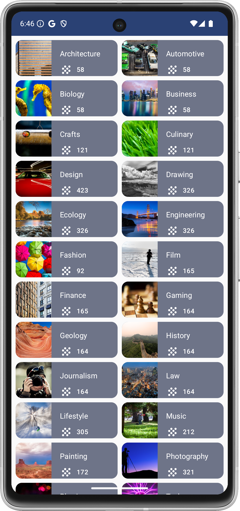

Courses App
=================================

Introduction
------------
The Courses app displays a list of course topics presented in a grid format.
Each topic item displays the image, the name, the number of associated courses, and a decorative icon.

Screenshot(s)
---------------
